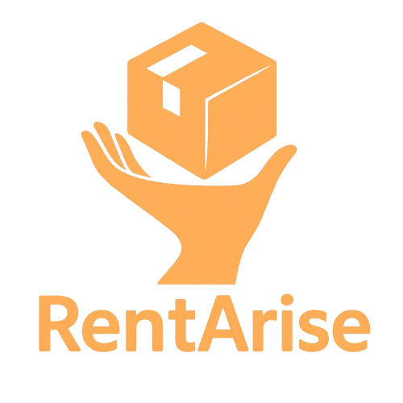

  

<h1 align="center">RentArise — Gestão de Aluguel de Equipamentos (Em desenvolvimento)</h1>

Sistema web para facilitar e otimizar o processo de aluguel de equipamentos.  
A plataforma será desenvolvida para atender tanto **administradores** quanto **clientes**, com foco na **organização**, **controle** e **emissão de relatórios/contratos**.

---

## 🎯 Objetivo

O projeto tem como propósito centralizar e automatizar a gestão de aluguel de equipamentos, oferecendo:

- 📦 Cadastro e gerenciamento de equipamentos, clientes e contratos;
- 📊 Painel administrativo com visualização de dados interativa;
- 📈 Relatórios dinâmicos e informativos para acompanhamento.

---

## 🧑‍💻 Desenvolvedores 

- [Jorge Gabriel](https://github.com/J0rgeGabriel)  
- [Pedro Augusto](https://github.com/Airesp4)

---

## 💡 Funcionalidades

- 📝 Cadastro de equipamentos e clientes  
- 📁 Criação e gestão de contratos de aluguel  
- 🔐 Autenticação com níveis de acesso (admin e cliente)  
- 📄 Geração de relatórios dinâmicos para clientes  
- 🧭 Navegação intuitiva em painéis interativos  

---

## 🖥️ Telas previstas

A aplicação contará com no mínimo **8 telas**, incluindo:

- 🔑 Login  
- 📊 Dashboard  
- ➕ Cadastro de Equipamentos  
- 👥 Cadastro de Clientes  
- 📄 Gestão de Contratos  
- 📈 Visualização de Relatórios  
- 🙍 Perfil do Usuário  
- 🆘 Tela de Suporte/Contato  

---

## 🛠️ Tecnologias

- 🧩 **Frontend:** Angular  
- 🧠 **Backend:** NestJS  
- 🗃️ **Banco de Dados:** PostgreSQL  
- ⚙️ **ORM:** TypeORM  
- 🔤 **Linguagem:** TypeScript  
- 🛡️ **Autenticação:** JWT + Bcrypt.js  
- ⚙️ **Configuração:** Dotenv  
- 📚 **Documentação da API:** Swagger  

---
